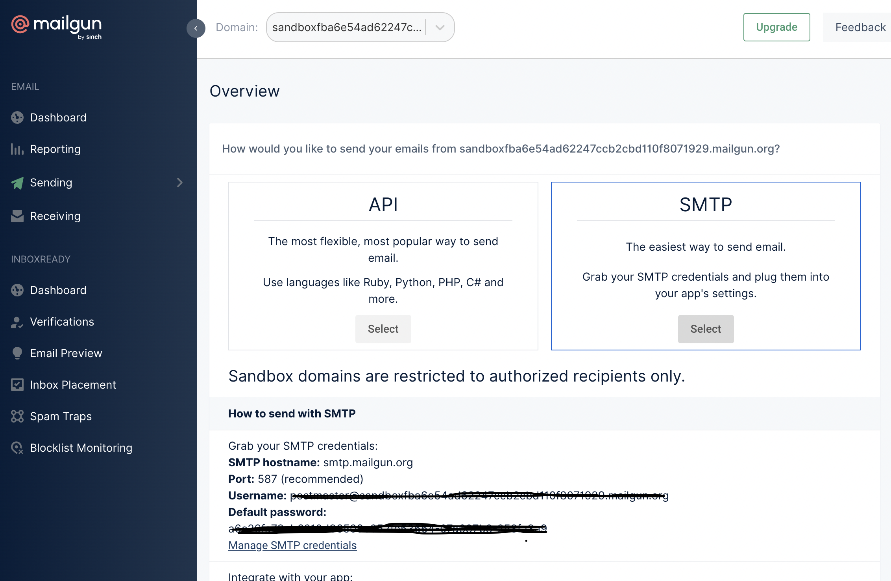
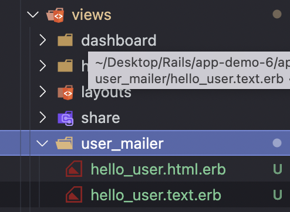

# Mailer
[←回到上一頁](//RubyonRails.md)

起手式

```ruby
gem install “mail”
```

google信箱容易被丟到垃圾郵件，以及一些奇怪的問題導致收不到信。

這裡採用第三方寄信服務[**mailgum**](https://www.mailgun.com/)

## mail設定

```ruby
# config/environments/development.rb

config.action_mailer.delivery_method = :smtp
  # delivery_method 有三種寄信方式 :test、:sendmail 和 :smtp
  # sendmail 須搭配 server 的 /user/bin/sendmail application
  # 而這邊我是透過 mailgun(and gmail) 的 smtp 協定作寄信
  # Mailgum
  config.action_mailer.smtp_settings = config_for(:email).symbolize_keys
  # config_for找到config目錄下的名為email的YAML設定檔，symbolize_keys將hash裡的string key轉為symbol key(smtp吃的是symbol key)

config.action_mailer.default_url_options = { host: "http://localhost:3000" }
  # 這邊填入的網址須要注意一下，他必須是絕對網址，且會被預設為 mail 中的 resource link
  # 像我是用 devise 寄發驗證信，所以 confirmation_url(@resource, confirmation_token: @token)
  # 中的 @resource 就會是 http://localhost:3000

config.action_mailer.raise_delivery_errors = true
  # rails_delivery_errors 設定為 false 可讓寄信時的錯誤被忽略，如果要 debug 就設 true
```

mailgum登入後會給一串預設的資料，這裡選擇SMTP



在config底下新增資料的yml檔，並且在.gitnore裡新增，為了在推送時排除掉自己的帳號密碼

```ruby
development:
  address: "smtp.mailgun.org"
  domain: "Your Domain"
  authentication: "plain"
  port: 587
  user_name: "YourUserName"
  password: "YourPassWord"
  enable_starttls_auto: true
production:
  address: "smtp.mailgun.org"
  domain: "Your Domain"
  authentication: "plain"
  port: 587
  user_name: "YourUserName"
  password: "YourPassWord"
  enable_starttls_auto: true
```

Mail初始化

```ruby
rails g mailer UserMailer hello_user
# 創建mailer的controller#hello_user這個方法及views
```


### 在app/mailers底下找到新建的user_mailer.rb

```ruby
class UserMailer < ApplicationMailer

  # Subject can be set in your I18n file at config/locales/en.yml
  # with the following lookup:
  #
  #   en.user_mailer.hello_user.subject
  #
  def hello_user(user) # 給一個user的參數丟進去
    @user = user
    @greeting = "Hi"

    mail to: @user.email
  end
end
```

### 在views底下的user_mailer裡面生成了一個html以及一個純文字的模板



預先都不要更動，到rails console內測試看看

```bash
> rails c
Running via Spring preloader in process 4617
Loading development environment (Rails 6.1.6.1)
3.0.0 :001 > u1 = User.fint_by(email: "geminilin0619@gmail.com")
3.0.0 :001 > UserMailer.hello_user(u1).deliver_now!(現在就寄出！！)

# 若是沒問題就會收到信了
Rendering layout layouts/mailer.html.erb
  Rendering user_mailer/hello_user.html.erb within layouts/mailer
  Rendered user_mailer/hello_user.html.erb within layouts/mailer (Duration: 0.4ms | Allocations: 300)
  Rendered layout layouts/mailer.html.erb (Duration: 1.0ms | Allocations: 502)
  Rendering layout layouts/mailer.text.erb
  Rendering user_mailer/hello_user.text.erb within layouts/mailer
  Rendered user_mailer/hello_user.text.erb within layouts/mailer (Duration: 0.2ms | Allocations: 105)
  Rendered layout layouts/mailer.text.erb (Duration: 0.4ms | Allocations: 258)
UserMailer#hello_user: processed outbound mail in 63.7ms
 => #<Mail::Message:16680, Multipart: true, Headers: <Date: Tue, 06 Sep 2022 11:49:20 +0800>, <From: from@example.com>, <To: geminilin0619@gmail.com>, <Message-ID: <6316c3402a69c_13e4d0c46f3@VintLins-MBA.local.mail>>, <Subject: Hello user>, <Mime-Version: 1.0>, <Content-Type: multipart/alternative; boundary="--==_mimepart_6316c33edf229_13e4d0c4590"; charset=UTF-8>, <Content-Transfer-Encoding: 7bit>>
```

# signed_id

```ruby
u1 = User.last
u1.signed_in(expires_in: 15.minutes) # 設定15分鐘後失效
u1.signed_in(expires_in: 15.minutes, purpose: "reset_password") #加上reset_password訊息到token裡
```


