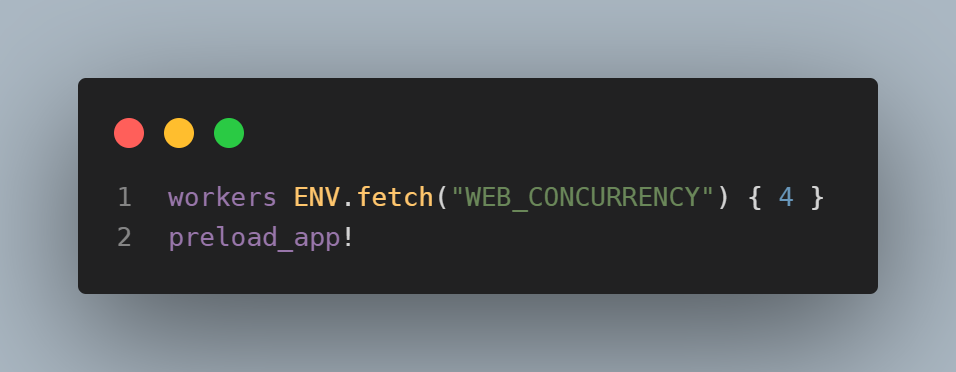

# 佈署到 Render
[←回到上一頁](//RubyonRails.md)

## 設定database.ymal  環境變數。

## 設定Puma.rb這兩行註解掉



## 設定production.rb


## 建立一個render-build.sh來自動跑build script


# render.yaml的配置

在根目錄底下


要跑這行

```bash
bundle lock --add-platform x86_64-linux
```

在Render使用blueprint創建專案的時候把config/master.key的密鑰貼到環境變數上。
